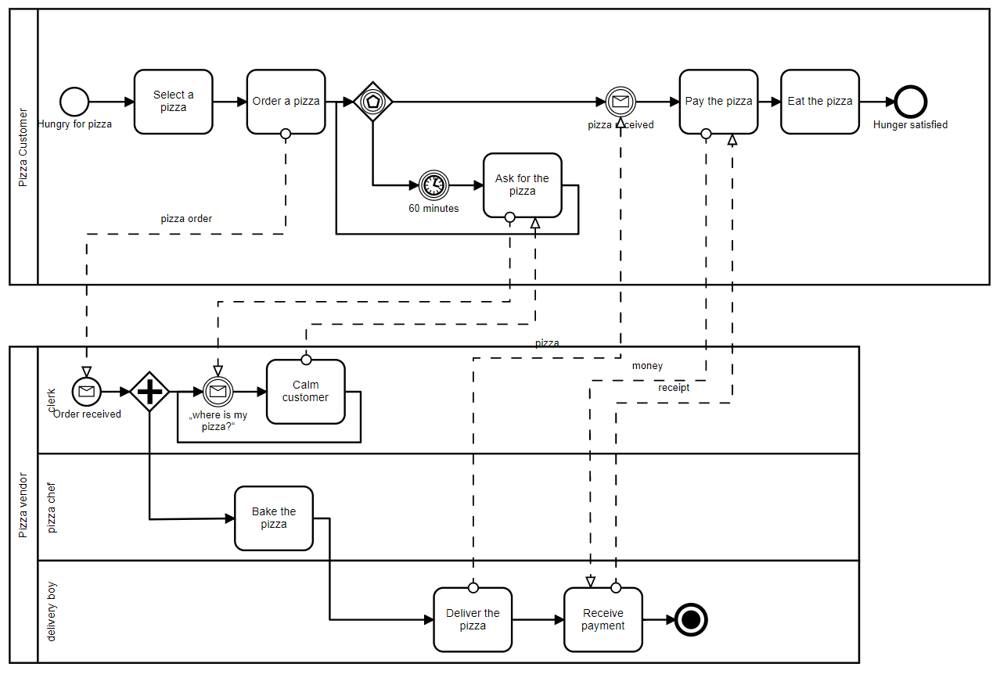

# bpmn-js bundling example

This example showcases how add [bpmn-js](https://github.com/bpmn-io/bpmn-js)
into a node-style application and bundle it for the browser using
[Browserify](http://browserify.org).


## About

This example uses bpmn-js to embed the [pizza collaboration](http://demo.bpmn.io/s/pizza-collaboration) diagram into a web application.




## Usage Summary

Install bpmn-js via [npm](http://npmjs.org)

```
npm install --save bpmn-js
```

Use it in your application

```javascript
var BpmnViewer = require('bpmn-js');

var viewer = new BpmnViewer({
  container: '#canvas'
});

viewer.importXML(pizzaDiagram, function(err) {

  if (!err) {
    console.log('success!');
    viewer.get('canvas').zoom('fit-viewport');
  } else {
    console.log('something went wrong:', err);
  }
});
```

Bundle the `src/app.js` file for the browser with browserify:

```
browserify src/app.js -t brfs -o public/app.bundled.js
```

__Note:__ You may use another module bundler such as [Webpack](https://webpack.js.org/),
too.


## Building the Example

Initialize the project dependencies via

```
npm install
```

To create the sample distribution in the `public` folder run

```
npm run all
```


## License

MIT